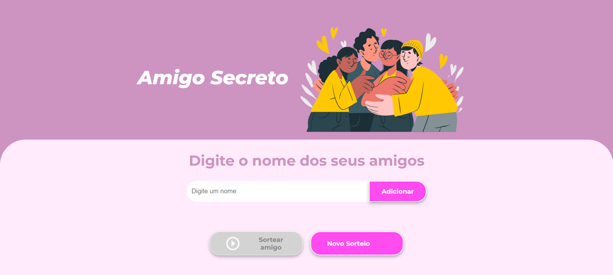

# Jogo Amigo Secreto 🤫📱

Seja bem-vindo ao **Jogo Amigo Secreto**! Este é um projeto que permite adicionar os nomes dos amigos e realizar um sorteio automático para descobrir quem será o amigo secreto de cada um. Perfeito para organizar trocas de presentes de forma divertida e surpreendente!



---

## 🛠 Tecnologias

O projeto foi desenvolvido utilizando:

- **HTML5**: Para estruturar a página.
- **CSS3**: Para o design e a responsividade.
- **JavaScript**: Para a interatividade e o sorteio.

---

## ✨ Funcionalidades

Aqui estão as principais funcionalidades que tornam o jogo único:

- **Adicionar amigos**: Insira os nomes dos participantes na lista do sorteio.
- **Lista ordenada alfabeticamente**: A lista de amigos é automaticamente organizada em ordem alfabética.
- **Sortear amigos secretos**: Realize o sorteio de forma dinâmica e descubra quem é o amigo secreto de quem.
- **Botão de novo sorteio**: Permite realizar um novo sorteio rapidamente, sem precisar reinserir os nomes.
- **Facilidade ao adicionar nomes**: Além do botão "Adicionar", você pode pressionar a tecla **Enter** para incluir os nomes diretamente.
- **Design responsivo**: A interface se adapta a qualquer dispositivo, garantindo uma ótima experiência no computador, tablet ou smartphone.

---

## 🧠 Como Usar

Para testar o jogo, siga os passos abaixo:

1. Acesse o repositório do projeto:

```bash
git clone https://github.com/seu-usuario/Amigo-Secreto.git
 ```

2. Acesse o site para rodar o jogo:

```bash
[**Clique aqui para acessar**](https://vercel.app)
```
---

## 💡 Sobre o Desafio

Este projeto foi criado como parte de um **desafio do curso Iniciante em Programação da One Oracle com a Alura**. O desafio pedia o desenvolvimento de uma aplicação que permitisse aos usuários:

- **Inserir nomes** em uma lista por meio de um campo de texto e um botão "Adicionar".
- **Validar a entrada** para garantir que o campo de texto não esteja vazio.
- **Exibir a lista de nomes inseridos** de forma visível.
- **Realizar um sorteio aleatório** ao clicar no botão "Sortear Amigo" e exibir o resultado na tela.

---

### 🔥 Diferenciais Implementados

Além das funcionalidades básicas solicitadas, foram adicionadas as seguintes melhorias ao projeto:

- **Botão "Novo Sorteio"**: Agora, é possível realizar um novo sorteio sem reinserir os nomes.
- **Lista ordenada automaticamente**: A lista de amigos é exibida em ordem alfabética para facilitar a organização.
- **Tecla Enter funcional**: Os usuários podem pressionar **Enter** para adicionar um nome à lista, sem precisar usar o mouse.
- **Site responsivo**: O design foi ajustado para funcionar perfeitamente em qualquer dispositivo, tornando o jogo acessível para todos.

